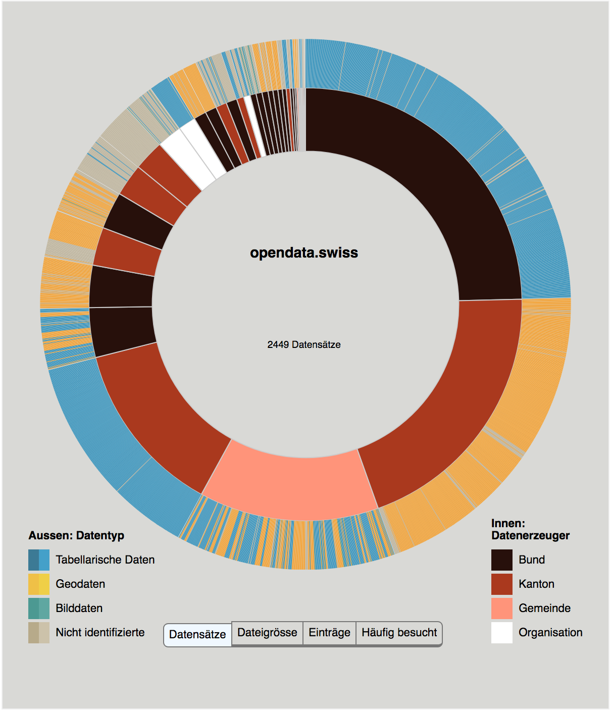

# opendata.swiss Crawler

This is a crawler for the Open Data-Plattform of the Swiss Confederation. [opendata.swiss](http://opendata.swiss) collects open datasets from the national, cantonal and communal administration which is published for free use. The crawler attempts to download each dataset and analyze it.

The result is an interactive viusalization that allows the exploriation of the data on the platform by different criteria.

## Usage

First of all you should set all the options in `config.py` to your preference.

The dependecies are:

* Python 2.7 and everything in `requirements.txt`
* Node.js

And that is basically it. You can now run:

    python main.py

in your console.

One complete run takes about 16 hours in order to download and analyze over 3000 datasets.

## Results

The result of the analysis is stored at the `output_file` path that is defined in the `config.py` file. Examples of previous runs can be found in the `data` directory.

## Visualisation

Opening the `index.html` file displays a visualization of a data file. By default it uses one of the existing files in `data` from a previous analysis. If you want to modify it to display the data from your own run, it's not very hard, although the code is a bit messy. You need to set the variable `dataset` in `index.html` to the path of you output file.

### Visits

The visits data is not open. Therefore this tab doesn't work in the visualization. Sorry about that.

<iframe id="landscape" src="https://jonasoesch.ch/content/02-articles/9-opendata-landscape/cantons/cantons.htmll" width="100%" height="500px"></iframe>
